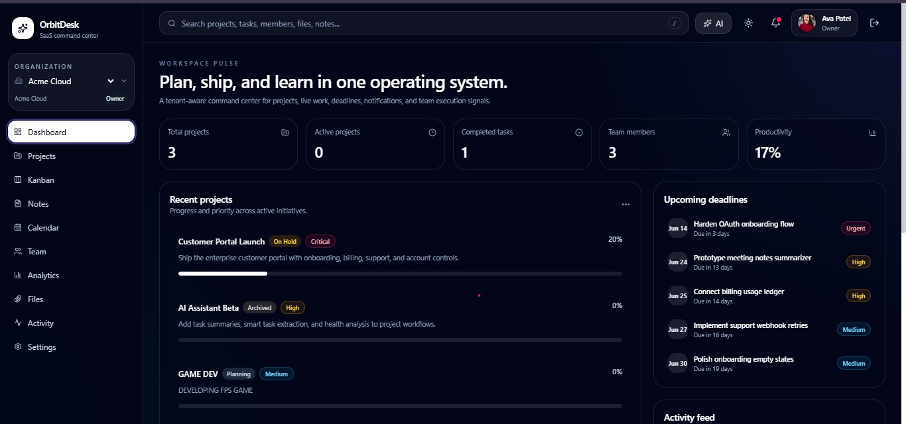
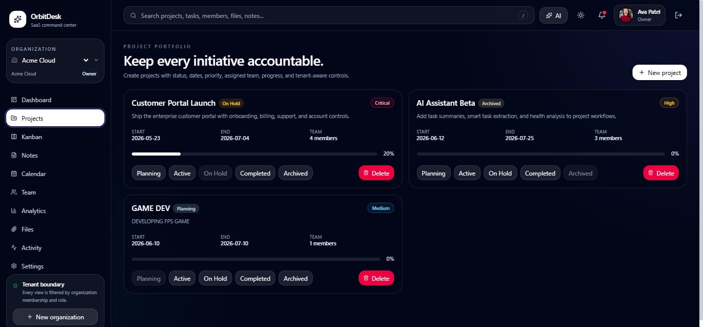
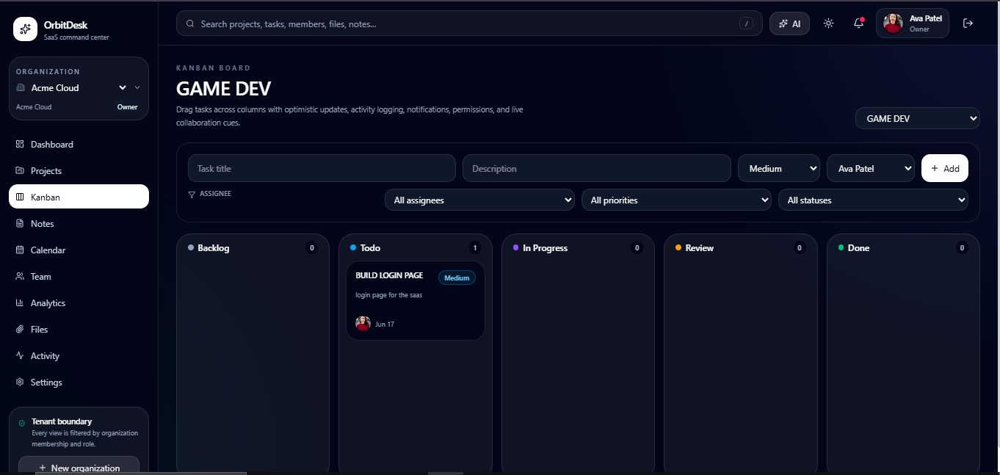
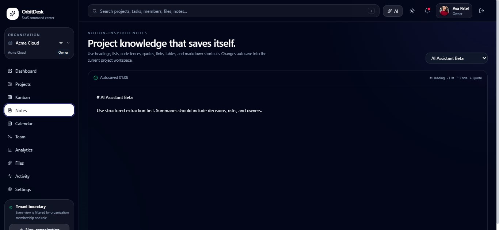
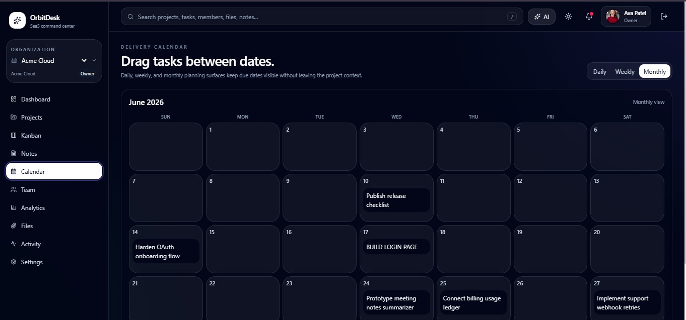
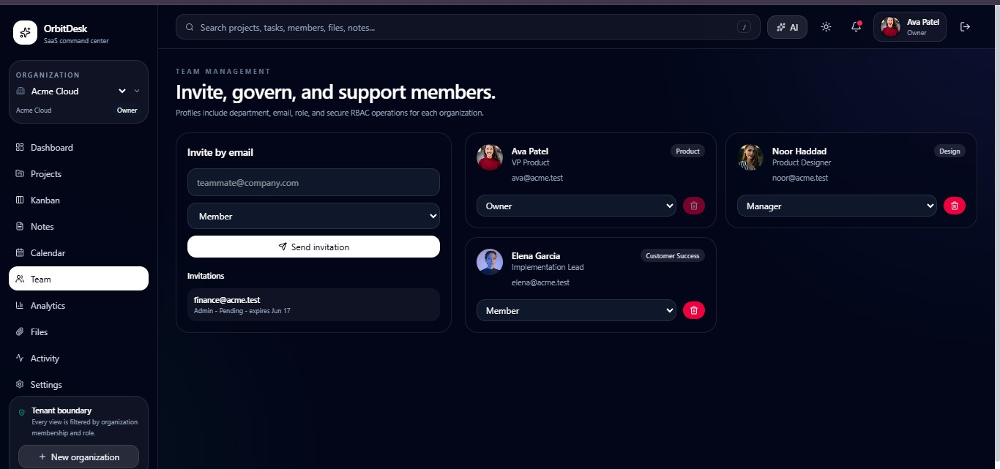
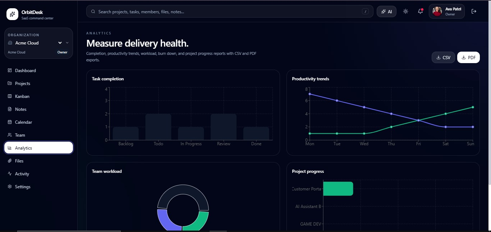
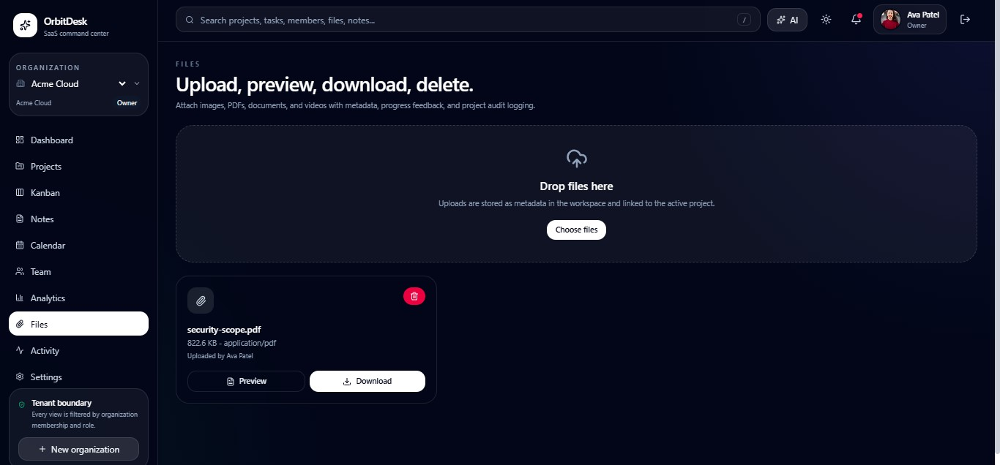
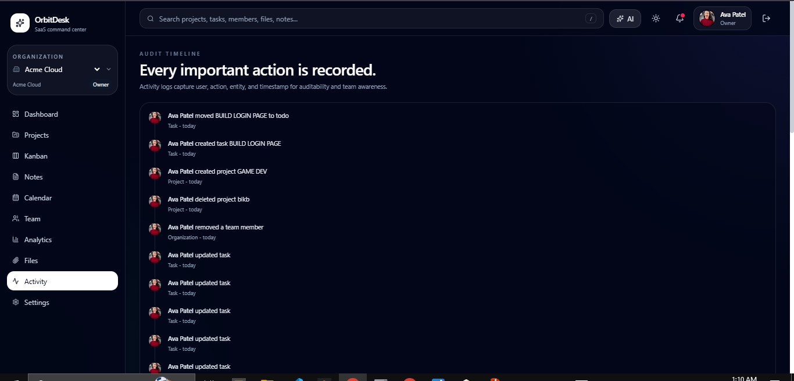
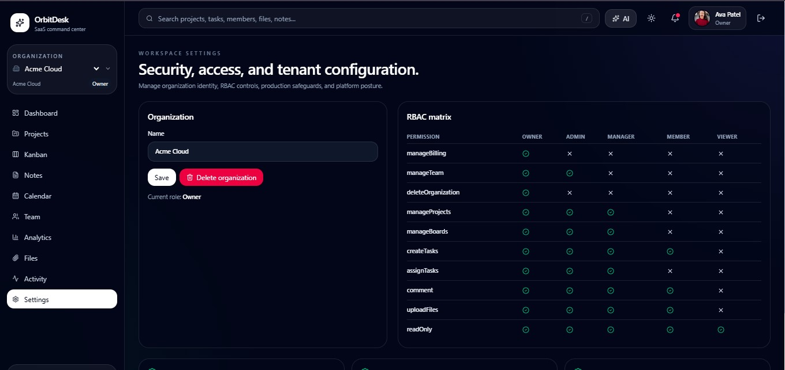

<div align="center">
  <br />
  <h1>OrbitDesk</h1>
  <p><strong>Open-source SaaS project management platform</strong></p>
  <p>Multi-tenant Kanban workspace with RBAC, real-time collaboration, AI insights, and a full analytics suite.</p>
  <br />
</div>

## Overview

OrbitDesk is a commercial-grade, open-source project management platform designed for modern teams. It combines Kanban execution, structured documentation, role-based access control, real-time collaboration, file management, notifications, and AI-powered planning into a single tenant-aware application.

Built with React 19, TypeScript, Tailwind CSS 4, and Vite on the frontend, with a PostgreSQL + Redis + Prisma ORM backend, OrbitDesk can be self-hosted via Docker or deployed to any Node.js environment.

## Screenshots

<table>
  <tr>
    <td align="center"><br/><em>Dashboard</em></td>
    <td align="center"><br/><em>Kanban Board</em></td>
  </tr>
  <tr>
    <td align="center"><br/><em>Projects View</em></td>
    <td align="center"><br/><em>Task Detail</em></td>
  </tr>
  <tr>
    <td align="center"><br/><em>Team Management</em></td>
    <td align="center"><br/><em>Analytics</em></td>
  </tr>
  <tr>
    <td align="center"><br/><em>Notes</em></td>
    <td align="center"><br/><em>Calendar</em></td>
  </tr>
  <tr>
    <td align="center"><br/><em>Activity Feed</em></td>
    <td align="center"><br/><em>Settings</em></td>
  </tr>
</table>

## Features

- **Multi-tenant Organizations** — Switch between organizations with isolated data, membership, and permissions
- **Role-Based Access Control** — Five roles (Owner, Admin, Manager, Member, Viewer) with granular permission matrix
- **Kanban Boards** — Drag-and-drop task management with `@dnd-kit`, column filtering, and search
- **Task Management** — Prioritization (Low/Medium/High/Urgent), labels, checklists, file attachments, due dates
- **Project Tracking** — Status workflow (Planning, Active, On Hold, Completed, Archived), progress bars, and priority
- **Real-time Collaboration** — Socket.IO-powered presence indicators, typing signals, and live task updates
- **Activity Logging** — Full audit trail for every entity with actor, action, and timestamp
- **Notifications** — Task assignments, completions, mentions, invitations, and due date reminders
- **Comments & Reactions** — Threaded discussions with emoji reactions and @mentions
- **Analytics Dashboard** — Charts (Bar, Line, Pie via Recharts) with project metrics, productivity, and trends
- **AI Features** — Natural language task extraction, project health analysis, meeting note summaries
- **Documentation Notes** — Per-project markdown notes stored alongside tasks
- **Calendar View** — Date-aware task overview with relative deadlines
- **Search** — Fuzzy search across projects, tasks, members, files, and notes
- **File Attachments** — S3-compatible storage, file listing by project/task
- **Invitation System** — Email-based invites with token expiration and role assignment
- **Dark Mode** — Full theme toggle with persisted preference
- **PDF Export** — Dashboard reports via jsPDF
- **Password Recovery** — Reset token flow with expiration
- **Session Management** — Refresh tokens, session tracking, and timeout

## Tech Stack

| Layer | Technology |
|-------|-----------|
| **Frontend** | React 19, TypeScript, Vite 7, Tailwind CSS 4, Framer Motion |
| **State** | Zustand (persisted to localStorage) |
| **Drag & Drop** | @dnd-kit Core / Sortable |
| **Forms** | React Hook Form + Zod |
| **Charts** | Recharts |
| **Backend** | Express (API routes, RBAC middleware) |
| **Database** | PostgreSQL 16 via Prisma ORM 7 |
| **Realtime** | Socket.IO 4 |
| **Auth** | next-auth, bcryptjs, refresh tokens |
| **Cache** | Redis 7 |
| **File Storage** | S3-compatible |
| **Security** | Helmet, express-rate-limit, CSRF, sanitize-html |
| **Infrastructure** | Docker Compose (app + postgres + redis), Nginx |
| **Testing** | Jest, Playwright, Testing Library |

## Prisma Schema

The data model includes 26+ models:

- `User`, `Account`, `Session`, `RefreshToken`, `PasswordResetToken`
- `Organization`, `Membership`, `Invitation`
- `Team`, `TeamMember`
- `Project`, `Board`, `Column`, `Task`, `Label`, `TaskLabel`
- `Comment`, `CommentReaction`, `Checklist`, `ChecklistItem`
- `File`, `ActivityLog`, `Notification`, `Note`, `Analytics`, `AIInsight`

Every query is scoped by `organizationId` for tenant isolation. Soft deletes (`deletedAt`) are supported on `User`, `Organization`, `Task`, `Comment`, and `File`.

## RBAC Permission Matrix

| Permission | Owner | Admin | Manager | Member | Viewer |
|-----------|-------|-------|---------|--------|--------|
| Manage Billing | ✓ | | | | |
| Delete Organization | ✓ | | | | |
| Manage Team | ✓ | ✓ | | | |
| Manage Projects | ✓ | ✓ | ✓ | | |
| Manage Boards | ✓ | ✓ | ✓ | | |
| Assign Tasks | ✓ | ✓ | ✓ | | |
| Create Tasks | ✓ | ✓ | ✓ | ✓ | |
| Comment | ✓ | ✓ | ✓ | ✓ | |
| Upload Files | ✓ | ✓ | ✓ | ✓ | |
| Read Only | ✓ | ✓ | ✓ | ✓ | ✓ |

## API Routes

The REST API contract (`server/api-contract.json`) defines 50+ endpoints:

- **Auth** — signup, login, logout, forgot/reset password, session, refresh
- **Organizations** — create, update, delete, list
- **Members** — list, change role, remove
- **Invitations** — create, list, accept
- **Projects** — CRUD with status/priority/dates
- **Boards/Columns** — create board, update column
- **Tasks** — CRUD, move, checklist management
- **Comments** — CRUD with reactions and threading
- **Files** — get upload URL, complete upload, delete
- **Notifications** — list, mark read, mark all read
- **Notes** — get/update per project
- **Analytics** — aggregated metrics
- **Calendar** — date-scoped task listing
- **Search** — cross-entity fuzzy search
- **AI** — smart task extraction, task summary, meeting summary, project health

## Getting Started

### Prerequisites

- Node.js 22+
- Docker & Docker Compose (for PostgreSQL and Redis)

### Quick Start (Docker)

```bash
# Clone the repository
git clone https://github.com/your-org/orbitdesk.git
cd orbitdesk

# Copy environment variables
cp .env.example .env

# Start services
docker compose up -d

# Run database migrations
npx prisma migrate dev

# Seed the database
npx prisma db seed

# Build and run
docker compose up app
```

### Development

```bash
# Install dependencies
npm install

# Copy environment file
cp .env.example .env

# Start PostgreSQL and Redis (Docker)
docker compose up -d postgres redis

# Run migrations
npx prisma migrate dev

# Seed with demo data
npx prisma db seed

# Start Vite dev server
npm run dev
```

Demo credentials: **ava@acme.test** / **Password123!**

### Production Build

```bash
npm run build
npm run preview
```

## Project Structure

```
├── src/                    # Frontend application
│   ├── App.tsx            # Main application (single-page workspace)
│   ├── main.tsx           # Entry point
│   ├── index.css          # Tailwind imports
│   ├── lib/
│   │   └── platform.ts    # Types, schemas, seed data, utilities
│   ├── stores/
│   │   └── workspace.ts   # Zustand store with all state & actions
│   └── utils/
│       └── cn.ts          # clsx + tailwind-merge utility
├── server/
│   ├── api-contract.json  # API route definitions & permission map
│   ├── rbac.ts            # Role-based access control logic
│   └── realtime.ts        # Socket.IO server for live updates
├── prisma/
│   ├── schema.prisma      # Database schema (26 models)
│   └── seed.ts            # Database seeder
├── docs/
│   ├── API.md
│   ├── ARCHITECTURE.md
│   ├── DEPLOYMENT.md
│   └── SECURITY.md
├── tests/                 # Test suites
├── docker-compose.yml     # App + PostgreSQL + Redis
├── Dockerfile             # Multi-stage production build
├── nginx.conf             # Nginx reverse proxy config
└── playwright.config.ts   # E2E test configuration
```

## Security

- Tenant isolation via `x-organization-id` header and `organizationId` scoping on every query
- Password hashing with bcryptjs
- CSRF protection with rotating tokens
- Rate limiting per window (configurable via env)
- Session refresh tokens with revocation
- Helmet security headers
- Input sanitization via `sanitize-html`
- CORS restricted to allowed origins

## License

MIT
